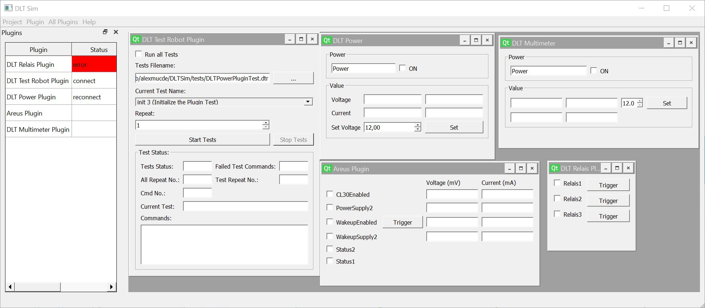

# DLTSim

DLTSim provides a Framework for Testing and Test Automation. Different Plugins are provided for a lot of purposes.
It provides an interface to DLT for Logging and Test Automation.

For further information about DLT visit the DLT Viewer project:

https://github.com/GENIVI/dlt-viewer

## Plugins

The following Plugins are currently supported:

* [DLTCanPlugin](plugins/DLTCanPlugin/doc)
* [DLTMultimeterPlugin](plugins/DLTMultimeterPlugin/doc)
* [DLTPowerPlugin](plugins/DLTPowerPlugin/doc)
* [DLTRelaisPlugin](plugins/DLTRelaisPlugin/doc)
* [DLTTestRobotPlugin](plugins/DLTTestRobotPlugin/doc)

## Installation

To build this SW the Qt Toolchain must be used.

## Usage

* dlt-sim.exe [options] configuration

* Options:
*  -?, -h, --help          Help
*  -v, --version           Version
*  -a                      Autostart Communication

* Arguments:
*  configuration           Configuration file

## Contributing

Contibutions are always welcome! Please provide a Pull Request on Github.

https://github.com/alexmucde/dlt-sim

## Donation

If you find this SW useful and you want to donate my work please select one of the following donations:

Paypal Donation:

Github Sponsors:

[:heart: Sponsor](https://github.com/sponsors/alexmucde)

## Changes

v0.0.1:

* Initial version

## Copyright

Alexander Wenzel <alex@eli2.de>

This code is licensed under Mozilla Public License.
