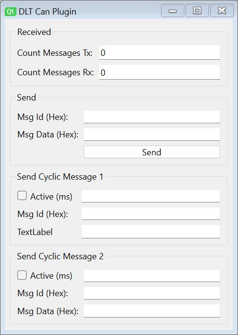
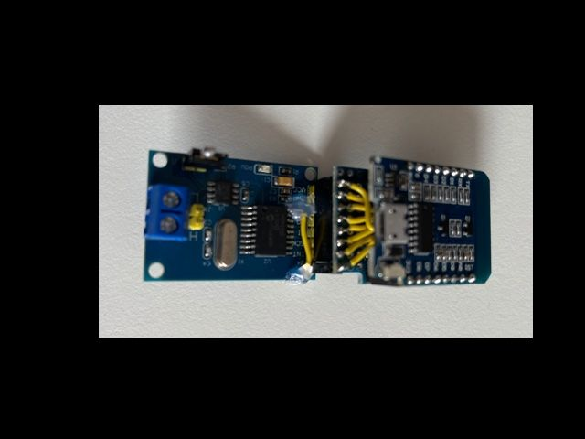
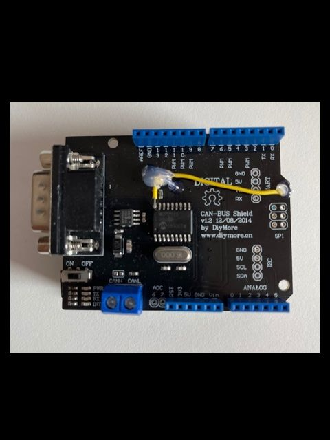

# DLTCanPlugin

DLTCanPlugin is used to log CAN message into a DLT TCP connection to a DLT Viewer.
It is developed for an Arduino SW running on a Wemos Mini D1 HW and an MCP2515 Adapter.

For further information about DLT visit the DLT Viewer project:

https://github.com/GENIVI/dlt-viewer

## Supported Hardware

The following Hardware is currently supported:

* CAN Board: Arduino Wemos Mini D1 + MCP2515 Board
* Wemos D1 R1 Board + Keyestudio CAN-BUS Shield
* Wemos D1 R1 Board + DiyMore CAN-BUS Shield

## Wemos Mini D1 Board + MCP2515 Board

The following parts are needed to setup a CAN board:

* Wemos D1 Mini [Buy at Amazon Germany](https://amzn.to/3thvzYd) [Buy at AliExpress](https://s.click.aliexpress.com/e/_AXoYOK)
* Optional: Triple Base or Dual Base [Buy at Amazon Germany](https://amzn.to/3eyI9Ov) [Buy at AliExpress Triple Base](https://s.click.aliexpress.com/e/_AXI4VC) [Buy at AliExpress Dual Base](https://s.click.aliexpress.com/e/_9In2Z0)
* Optional: Protoype Shield: [Buy at Amazon Germany](https://amzn.to/2Sia1xg) [Buy at AliExpress](https://s.click.aliexpress.com/e/_AcOmnN)
* MCP2515 Board: [Buy at Amazon Germany](https://amzn.to/3efc7Xs) [Buy at AliExpress](https://s.click.aliexpress.com/e/_AdUTRt)

CAUTION: Wemos D1 Mini needs 3.3V logic level, if not ESP8266 will be damaged.
Pin 18 of MCP2515 must be unsoldered and connected to 3.3V

The following pins from the Wemos D1 Mini to the MCP2515 Board must be connected:
* 3.3V -> Pin18 MCP2515
* 5V -> VCC
* GND -> GND
* D5 -> SCK
* D6 -> MISO SO
* D7 -> MOSI SI
* D8 -> CS
* D2 -> INT

## Wemos D1 R1 Board + Keyestudio CAN-BUS Shield (experimental)

The following parts are needed to setup a CAN board:

* Wemos D1 [Amazon Germany](https://amzn.to/3fdFrOu) [AliExpress](https://s.click.aliexpress.com/e/_AMlgFl)
* Keyestudio CAN_BUS Shield [Eckstein Shop](https://eckstein-shop.de/Keyestudio-CAN-BUS-Shield-MCP2551-chip-With-SD-Socket-For-Arduino-UNO-R3) [AliExpress](https://s.click.aliexpress.com/e/_9ixgBl)

CAUTION: Wemos D1 R1 needs 3.3V logic level, if not ESP8266 will be damaged.
Pin 18 of MCP2515 must be unsoldered and connected to 3.3V

The following pins from the Wemos D1 R1 are connected to the CAN Bus shield:

* 13 -> D5 SCK
* 12 -> D6 MISO
* 11 -> D7 MOSI
* 10 -> D10 CS
* 8 INT -> D8
* 3.3V -> Pin18 MCP2515
* 5V -> 5V
* GND -> GND
* RST -> RST

## Wemos D1 R1 Board + DiyMore CAN-BUS Shield (not working yet)

The following parts are needed to setup a CAN board:

* Wemos D1 [Amazon Germany](https://amzn.to/3fdFrOu) [AliExpress](https://s.click.aliexpress.com/e/_AMlgFl)
* Keyestudio CAN_BUS Shield [AliExpress](https://s.click.aliexpress.com/e/_AWnohh)

CAUTION: Wemos D1 R1 needs 3.3V logic level, if not ESP8266 will be damaged.
Pin 18 of MCP2515 must be unsoldered and connected to 3.3V

The following pins from the Wemos D1 R1 are connected to the CAN Bus shield:

* 13 -> D5 SCK
* 12 -> D6 MISO
* 11 -> D7 MOSI
* 10 -> D10 CS
* 2 INT -> D2
* 3.3V -> Pin18 MCP2515
* 5V -> 5V
* GND -> GND
* RST -> RST

## Arduino SW

The following Arduino SW is needed 

[WemosD1MiniCAN.ino](https://github.com/alexmucde/dlt-sim/blob/main/plugins/DLTCanPlugin/arduino/WemosD1MiniCAN/WemosD1MiniCAN.ino)
[WemosD1R1CANDiymore.ino](https://github.com/alexmucde/dlt-sim/blob/main/plugins/DLTCanPlugin/arduino/WemosD1R1CANDiymore/WemosD1R1CANDiymore.ino)
[WemosD1R1CANKeyestudio.ino](https://github.com/alexmucde/dlt-sim/blob/main/plugins/DLTCanPlugin/arduino/WemosD1R1CANKeyestudio/WemosD1R1CANKeyestudio.ino)

The Arduino SW is based on the Wemos Library:

[Wemos Library](https://github.com/alexmucde/WemosLibrary)

Clone or copy the Wemos Library into the Arduino Libraries folder before compiling the sketch.

Compile, upload and run the SW with the [Arduino IDE](https://www.arduino.cc/en/software).

Select the right Board Wemos D1 Mini or Wemos D1 R1 in the Arduino Studio.

Select in the Source code the right CAN configuration for your board

### Features

The Arduino SW provides the following Features:

* Init status
* Forward Standard and Extended CAN message
* Send two specific messages cyclical (optional)

### Protocol

The Wemos D1 Mini is connected by a virtual serial device on USB. The serial port settings are 115.200 Baud with 8N1 and no handshake.

A USB driver is needed which can be found here:

https://www.wemos.cc/en/latest/ch340_driver.html

The protocol is binary.

Each message starts with the byte "0x7f".
If the payload of a message contains the byte "0x7f", two bytes with "0x7f" are sent.

The following commands are used

* "0x7f 0x00": Init ok
* "0x7f 0x01": Send ok
* "0x7f 0x02": Watchdog
* "0x7f 0x80 length 2BytesId payload": Standard CAN message
* "0x7f 0x81 length 4BytesId payload": Extended CAN message
* "0x7f 0xfe": Send error
* "0x7f 0xff": Init error

## DLT Injection commands

* CAN \<hex id\> \<hex message\>
* CANCYC1 \<decimal time ms\> \<hex id\> \<hex message\>
* CANCYC1 off
* CANCYC2 \<decimal time ms\> \<hex id\> \<hex message\>
* CANCYC2 off

## Contributing

Contibutions are always welcome! Please provide a Pull Request on Github.

https://github.com/alexmucde/dlt-sim

## Donation

If you find this SW useful and you want to donate my work please select one of the following donations:

Paypal Donation:

Github Sponsors:

[:heart: Sponsor](https://github.com/sponsors/alexmucde)

## Changes

v0.0.1:

* initial version

## Copyright

Alexander Wenzel <alex@eli2.de>

This code is licensed under Mozilla Public license.
