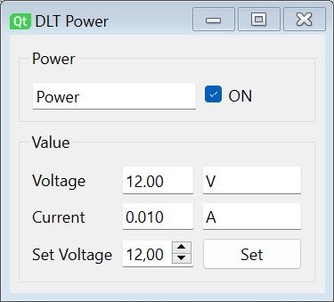

# DLTMultimeterPlugin

DLTMultimeterPlugin is used to control Multimeter for Test Automation.
Different Multimeters are supported.
It provides an interface to DLT for Logging and Test Automation.

For further information about DLT visit the DLT Viewer project:

https://github.com/GENIVI/dlt-viewer

## Supported Hardware

The following Hardware is currently supported:

* Multimeter: HoldPeak HP-90EPC [Amazon Germany](https://amzn.to/3bIsPwT) [AliExpress](https://s.click.aliexpress.com/e/_AM1Vsi)
  * Interface: USB Serial
  * Protocol: https://sigrok.org/wiki/Multimeter_ICs#Fortune_Semiconductor_FS9721_LP3
  * USB Driver: https://www.holdpeak.de/download/
* Multimeter: OWON XDM1041
  * Interface: USB Serial
  * Protocol: https://github.com/TheHWcave/OWON-XDM1041/blob/main/SCPI/XDM1041-SCPI.pdf
  * USB Driver: Same as Arduinow Wemos D1

## DLT injection commands

The commands are interpreted independent of the service id.

* VOLTAGE \<value\>

## Contributing

Contibutions are always welcome! Please provide a Pull Request on Github.

https://github.com/alexmucde/dlt-sim

## Donation

If you find this SW useful and you want to donate my work please select one of the following donations:

Paypal Donation:

Github Sponsors:

[:heart: Sponsor](https://github.com/sponsors/alexmucde)

## Changes

v0.0.01:

* Initial version

## Copyright

Alexander Wenzel <alex@eli2.de>

This code is licensed under Mozilla Public license.
