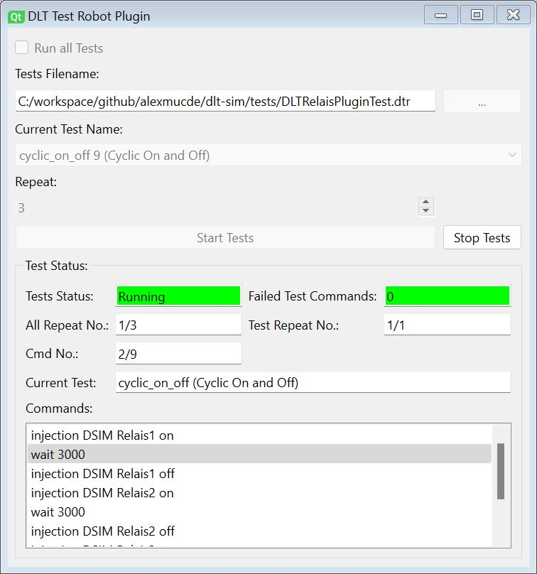

# DLTTestRobotPlugin

DLTTestRobotPlugin is used to run Test sripts to automate tests in combination with the DLT Viewer.

For further information about DLT visit the DLT Viewer project:

https://github.com/GENIVI/dlt-viewer

### Features

* Init status

## Protocol with DLT Viewer Plugin DLTTestRobot

The DLTTestRobotPlugin application sets up a TCP connection at Port 4490 with the DLT Viewer plugin.
The protocol is based on ASCII commands. Each command is terminated by a newline '\n'.
The follwoing commands are currently supported:

* filter clear
* filter add <ecuId> <appId> <ctxId>
* injection <ecuId> <command>
* newFile <filename>
* openFile <filename>
* saveAsFile <filename>
* reopenFile
* clearfile
* quitDltViewer
* marker
* connectAllEcu
* disconnectAllEcu

The DLt Viewer plugin sends back the filtered DLT messages in the format ending with a newline '\n':

<ecuId> <appId> <ctxId> <decoded payload>

## Fileformat of test description *.dtr

All simulation and test commands are written into a text file.
Multiple tests are defined in a single file.
All empty lines and lines beginning with a ';' character will be ignored as comments

The following general commands are used

* version <versionnumber>

The following commands are used in each test

* test id <name_without_seperators>
* test description <extended description>
* test repeat <number>
* test fail next|continue|stop
* test begin
* <test command1>
* <test command2>
* <test commandx>
* test end

The following test commands inside a test can be used:

* filter clear
* filter add <ecuId> <appId> <ctxId>
* injection <ecuId> <command>
* wait <time in ms>
* wait <min in ms> <max in ms>
* find equal <time in ms> <ecuId> <appId> <ctxId> <find text>
* find unequal <time in ms> <ecuId> <appId> <ctxId> <find text>
* find greater <time in ms> <ecuId> <appId> <ctxId> <valueId> <value>
* find smaller <time in ms> <ecuId> <appId> <ctxId> <valueId> <value>
* measure <time in ms> <ecuId> <appId> <ctxId> <valueId> <description>

## Contributing

Contibutions are always welcome! Please provide a Pull Request on Github.

https://github.com/alexmucde/dlt-sim

## Donation

If you find this SW useful and you want to donate my work please select one of the following donations:

Paypal Donation:

Github Sponsors:

[:heart: Sponsor](https://github.com/sponsors/alexmucde)

## Changes

v0.0.1:

* Initial version

## Copyright

Alexander Wenzel <alex@eli2.de>

This code is licensed under Mozilla Public license.
